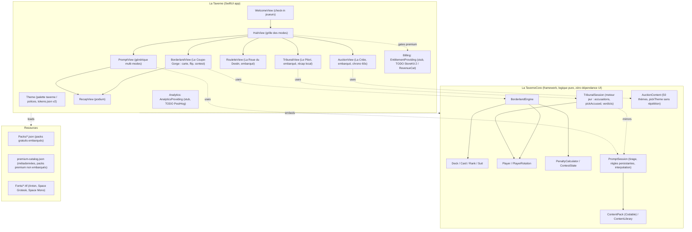

# La Taverne iOS

[](CHANGELOG.md)
[](https://github.com/Adam-Blf/la-taverne-ios/actions/workflows/ci.yml)
[](RELEASING.md)
[](project.yml)
[](LICENSE)

App iOS native de La Taverne, jeu de cartes et de défis pour soirées entre
adultes. Direction artistique néobrutalisme taverne, thème clair par
défaut : papier crème, encre noire, accent orange, ombres dures noires,
carte blanche géante comme élément signature. Le jeu de cartes s'appelle
Le Coupe-Gorge.

Développé sur Windows. Aucun compilateur Swift local n'est disponible sur
cette machine : le projet Xcode est **généré par XcodeGen** depuis
`project.yml`, et **compilé et testé par la CI GitHub Actions** sur runner
`macos-15`. Toute contribution doit passer par une Pull Request pour être
validée par la CI avant merge.

## Stack

- Swift 5.10, SwiftUI, iOS 17+
- XcodeGen (`project.yml`) pour générer `LaTaverne.xcodeproj`
- XCTest pour la couverture du moteur de jeu
- GitHub Actions (`macos-15`) pour build + tests

## Démarrage (sur une machine macOS avec Xcode)

```bash
brew install xcodegen
xcodegen generate
open LaTaverne.xcodeproj
```

Pour resynchroniser les packs de contenu depuis `la-taverne-content` (dépôt
frère, chemin relatif `../la-taverne-content`) :

```bash
python scripts/sync_content.py
```

Pour régénérer l'icône App Store 1024x1024 :

```bash
python scripts/gen_app_icon.py
```

## Architecture



## Contenu

Les packs de contenu (Action ou Vérité, Picolo, Tu préfères, etc.) sont
maintenus dans le dépôt frère `la-taverne-content` et synchronisés ici via
`scripts/sync_content.py` :

- **Packs gratuits** (`premium=false`) : copiés intégralement dans
  `La Taverne/Resources/Packs/`, embarqués dans le binaire.
- **Packs premium** : seules les métadonnées (titre, mode, intensité)
  vivent dans `La Taverne/Resources/premium-catalog.json`, pour afficher les
  cartes verrouillées du Hub. Le contenu réel n'est jamais livré tant que
  le billing n'est pas branché (zéro spoiler dans le binaire gratuit).

## Conformité App Store

- **Âge** : 17+, contenu réservé aux adultes, aucune référence à l'alcool
  (guideline 1.4.3). Wording store-safe : "pénalité" / "PÉNALITÉ MAJEURE",
  jamais de gorgée, shot ou alcool nommés. Mention "Jouez responsable."
  affichée sur l'écran d'accueil.
- **Achats in-app** (guideline 3.1.1) : aucun achat actif dans cette
  version. `Billing/EntitlementProviding` définit le contrat, `StubEntitlements`
  renvoie `isPremium = false` par défaut, chaque pack premium reste
  visuellement verrouillé. L'intégration StoreKit 2 / RevenueCat est
  esquissée en commentaire dans `EntitlementProviding.swift`, à activer une
  fois le produit non-consommable créé dans App Store Connect.
- **Suppression de compte** : l'app ne crée aucun compte serveur en v0.1
  (pas d'auth, pas de backend). Si un compte est introduit plus tard
  (sync cloud, achats liés à un identifiant), une fonctionnalité de
  suppression de compte devra être ajoutée avant soumission (guideline 5.1.1v).
- **Vie privée** : `Analytics/AnalyticsProviding` est désactivée par défaut
  (`isEnabled = false`), aucune télémétrie n'est envoyée sans consentement
  explicite. Aucune donnée personnelle collectée en v0.1 (les noms de
  joueurs restent en local, `UserDefaults`, jamais transmis).
- **Polices et assets** : entièrement embarqués (`Resources/Fonts/`,
  `Assets.xcassets`), aucune dépendance CDN, fonctionne hors ligne.

## Ce qu'il reste pour TestFlight

1. **Compte Apple Developer Program** (99 $/an) rattaché à l'identité
   d'Adam Beloucif ou à une entité, condition préalable à toute soumission.
2. **App Store Connect** : créer l'app (bundle id `com.beloucif.lataverne`),
   remplir fiche (description, mots-clés, captures d'écran, catégorie
   Jeux/Divertissement, classification d'âge 17+).
3. **Signing** : générer un certificat de distribution + provisioning
   profile App Store, ou déléguer à `fastlane match` (recommandé, gère la
   rotation et le partage d'équipe). Non inclus dans ce dépôt v0.1 (aucun
   secret de signature commité, cf. `.gitignore`).
4. **Fastlane** (à ajouter) : `fastlane/Fastfile` avec une lane `beta` qui
   build en Release, signe via `match`, et pousse vers TestFlight
   (`pilot upload`). La CI actuelle ne fait que build + test, pas de
   déploiement.
5. **Secrets CI** : si l'upload TestFlight est automatisé, stocker
   `APP_STORE_CONNECT_API_KEY` (clé API App Store Connect, format JSON/P8)
   en secret GitHub Actions, jamais en clair dans le repo.
6. **Icône finale** : le PNG 1024x1024 généré par `scripts/gen_app_icon.py`
   est une v1 fonctionnelle, à faire relire par un regard design avant
   soumission finale.
7. **Billing réel** avant toute mise en avant de contenu premium : StoreKit 2
   ou RevenueCat, produit non-consommable créé côté App Store Connect,
   tests sur compte sandbox.
