# La Taverne iOS

[](CHANGELOG.md)
[](https://github.com/Adam-Blf/la-taverne-ios/actions/workflows/ci.yml)
[](RELEASING.md)
[](project.yml)
[](LICENSE)

App iOS native de La Taverne, jeu de cartes et de défis pour soirées entre
adultes. Direction artistique néobrutalisme taverne, thèmes clair et
sombre : papier crème ou encre neutre (jamais de brun/bois), accent
orange, ombres dures noires, carte blanche géante comme élément
signature. Bascule clair/sombre/système persistée, discrète dans le Hub.
Le jeu de cartes s'appelle Le Coupe-Gorge.

Développé sur Windows. Aucun compilateur Swift local n'est disponible sur
cette machine : le projet Xcode est **généré par XcodeGen** depuis
`project.yml`, et **compilé et testé par la CI GitHub Actions** sur runner
`macos-15`. Toute contribution doit passer par une Pull Request pour être
validée par la CI avant merge.

## Stack

- Swift 5.10, SwiftUI, iOS 17+
- XcodeGen (`project.yml`) pour générer `LaTaverne.xcodeproj`
- XCTest pour la couverture du moteur de jeu
- GitHub Actions (`macos-15`) pour build + tests
- RevenueCat (`purchases-ios` 5.83.0) pour le billing, PostHog
  (`posthog-ios` 3.69.0) pour l'analytics, les deux gated par clé de
  configuration (voir Monétisation)

## Démarrage (sur une machine macOS avec Xcode)

```bash
brew install xcodegen
xcodegen generate
open LaTaverne.xcodeproj
```

Pour resynchroniser les packs de contenu depuis `la-taverne-content` (dépôt
frère, chemin relatif `../la-taverne-content`) :

```bash
python scripts/sync_content.py
```

Pour régénérer l'icône App Store 1024x1024 :

```bash
python scripts/gen_app_icon.py
```

## Architecture

```mermaid
flowchart TD
    subgraph Core["La TaverneCore (framework, logique pure, zéro dépendance UI)"]
        Deck["Deck / Card / Rank / Suit"]
        Player["Player / PlayerRotation (gender + relationship optionnels, locaux)"]
        Targeting["Targeting (gender-m/f, pair, single, couple - RNG injectable)"]
        Penalty["PenaltyCalculator / ContestState"]
        Engine["BorderlandEngine"]
        Content["ContentPack (Codable) / ContentLibrary"]
        Prompt["PromptSession (tirage, règles persistantes, interpolation)"]
        TribunalSession["TribunalSession (moteur pur : accusations, pickAccused, verdicts)"]
        AuctionContent["AuctionContent (50 thèmes, pickTheme sans répétition)"]
        QuizSession["QuizSession (moteur pur : cagnotte, choice cumuler/distribuer)"]
        RankingSession["RankingSession (moteur pur : podium secret, guessQuestion)"]
        WouldYouRatherSession["WouldYouRatherSession (moteur pur : vote A/B, minorité pénalisée)"]
    end

    subgraph App["La Taverne (SwiftUI app)"]
        Theme["Theme (palette taverne clair/sombre, polices, tokens.css)"]
        Welcome["WelcomeView (check-in joueurs + genre/statut facultatifs)"]
        Hub["HubView (grille des modes)"]
        Borderland["BorderlandView (Le Coupe-Gorge : carte, flip, contest)"]
        PromptView["PromptView (générique multi-modes)"]
        Roulette["RouletteView (La Roue du Destin, embarqué)"]
        TribunalView["TribunalView (Le Pilori, embarqué, récap local)"]
        AuctionView["AuctionView (La Criée, embarqué, chrono 60s)"]
        QuizView["QuizView (Quitte ou Trinque, embarqué, récap local)"]
        RankingView["RankingView (Le Tableau d'Honneur, embarqué, récap local)"]
        WouldYouRatherView["WouldYouRatherView (Tu préfères, embarqué, récap local)"]
        Recap["RecapView (podium)"]
        Paywall["PaywallView (3 offres, achat + restauration)"]
        Billing["Billing: EntitlementProviding (RevenueCatEntitlements si clé, sinon StubEntitlements)"]
        Analytics["Analytics: AnalyticsProviding (PostHogAnalytics si clé + consentement, sinon StubAnalytics)"]
    end

    subgraph Resources["Resources"]
        Packs["Packs/*.json (packs gratuits embarqués)"]
        Catalog["premium-catalog.json (métadonnées, packs premium non embarqués)"]
        Fonts["Fonts/*.ttf (Anton, Space Grotesk, Space Mono)"]
    end

    Welcome --> Hub --> Borderland
    Hub --> PromptView
    Hub --> Roulette
    Hub --> TribunalView
    Hub --> AuctionView
    Hub --> QuizView
    Hub --> RankingView
    Hub --> WouldYouRatherView
    Borderland --> Recap
    PromptView --> Recap
    Engine --> Deck
    Engine --> Player
    Engine --> Penalty
    Prompt --> Content
    PromptView -.resolves via.-> Targeting
    Targeting --> Player
    TribunalSession --> Player
    TribunalSession -.mirrors.-> Prompt
    QuizSession --> Player
    RankingSession --> Player
    WouldYouRatherSession --> Player
    Borderland -.uses.-> Engine
    PromptView -.uses.-> Prompt
    TribunalView -.uses.-> TribunalSession
    AuctionView -.uses.-> AuctionContent
    QuizView -.uses.-> QuizSession
    RankingView -.uses.-> RankingSession
    WouldYouRatherView -.uses.-> WouldYouRatherSession
    App -.embeds.-> Core
    App -.loads.-> Resources
    Hub -.gates premium.-> Billing
    Hub --> Paywall
    Paywall -.purchase/restore.-> Billing
    Paywall -.paywall_shown/dismissed/purchase_*.-> Analytics
```



## Contenu

Les packs de contenu (Action ou Vérité, Picolo, etc.) sont maintenus dans le
dépôt frère `la-taverne-content` et synchronisés ici via
`scripts/sync_content.py` :

`Tu préfères` n'est plus un pack de prompt : depuis la v0.9.0 c'est un mode
embarqué à mécanique de vote (`WouldYouRatherSession.swift`,
`WouldYouRatherContent.swift`, `WouldYouRatherView.swift`), au même titre que
Quitte ou Trinque ou Le Tableau d'Honneur. Le pack `tu-preferes-classique`
de `la-taverne-content` reste à retirer côté dépôt frère lors du prochain
`sync_content.py` pour éviter qu'il ne réapparaisse dans le catalogue.

- **Packs gratuits** (`premium=false`) : copiés intégralement dans
  `La Taverne/Resources/Packs/`, embarqués dans le binaire.
- **Packs premium** : seules les métadonnées (titre, mode, intensité)
  vivent dans `La Taverne/Resources/premium-catalog.json`, pour afficher les
  cartes verrouillées du Hub. Le contenu réel n'est jamais livré tant que
  le billing n'est pas branché (zéro spoiler dans le binaire gratuit).

## Thème clair/sombre

`Theme.Color` est entièrement dynamique : chaque token résout vers sa paire
clair/sombre via un `UIColor` calculé au trait collection courant (voir
`Theme.dynamic(light:dark:)`), donc aucun écran n'a besoin de connaître le
thème actif. La préférence (`ThemeMode` : système / clair / sombre) vit dans
`AppState.themeMode`, persistée (`UserDefaults`), appliquée via
`.preferredColorScheme` sur la `WindowGroup`. Bascule discrète dans le Hub
(icône soleil/lune, à côté de Récap). Le sombre reste sur une encre neutre
(`#141216`/`#1D1B20`), jamais teintée bois/brun, à parité avec
`la-taverne/src/styles/tokens.css`.

## Genre et statut relationnel des joueurs (facultatif)

Chaque joueur peut déclarer sur `WelcomeView`, dans un panneau replié par
défaut (icône réglages à côté de son nom) : un genre (Homme / Femme / Autre)
et/ou un statut relationnel (Célibataire / En couple). Les deux champs
restent optionnels et ne bloquent jamais la partie.

- **Stockage** : `Player.gender` / `Player.relationship`
  (`LaTaverneCore/Player.swift`), 100 % local (`UserDefaults` via
  `AppState.playerAttributes`), **jamais envoyés en analytics** (aucun call
  site de `AnalyticsProviding.track` ne référence ces champs).
- **Ciblage de contenu** : `LaTaverneCore/Targeting.swift` résout
  `PromptTarget.genderMasculine/.genderFeminine/.single/.couple/.pair` vers
  un ou deux joueurs concrets, RNG injectable et seedable par tour
  (`Targeting.seededRng`) pour rester stable entre deux re-rendus du même
  tour. Si personne à table n'a déclaré l'attribut demandé, repli gracieux
  sur un joueur actif tiré au hasard - la partie ne bloque jamais. Affiché
  sur `PromptView` sous forme de bannière "C'est à … de jouer", à parité
  avec `la-taverne/src/components/screens/PromptGameScreen.tsx`.

## Conformité App Store

- **Âge** : 17+, contenu réservé aux adultes, aucune référence à l'alcool
  (guideline 1.4.3). Wording store-safe : "pénalité" / "PÉNALITÉ MAJEURE",
  jamais de gorgée, shot ou alcool nommés. Mention "Jouez responsable."
  affichée sur l'écran d'accueil.
- **Achats in-app** (guideline 3.1.1) : billing réel via RevenueCat (voir
  section Monétisation), gated par clé de configuration absente par
  défaut. Sans clé (CI, clone frais), `StubEntitlements` renvoie
  `isPremium = false`, chaque pack premium reste visuellement verrouillé,
  et le bouton d'achat du paywall affiche "Bientôt disponible" au lieu
  d'un checkout cassé.
- **Suppression de compte** : l'app ne crée aucun compte serveur en v0.1
  (pas d'auth, pas de backend). RevenueCat identifie l'utilisateur par un
  identifiant anonyme géré par le SDK, pas de compte à supprimer. Si un
  compte serveur est introduit plus tard, une fonctionnalité de
  suppression de compte devra être ajoutée avant soumission (guideline 5.1.1v).
- **Vie privée** : `Analytics/AnalyticsProviding` est désactivée par défaut
  (`isEnabled = false`), aucune télémétrie n'est envoyée sans consentement
  explicite, même quand une clé PostHog est configurée. Aucune donnée
  personnelle collectée en v0.1 (les noms de joueurs, ainsi que le genre et
  le statut relationnel optionnels déclarés depuis la v0.12.0, restent en
  local, `UserDefaults`, jamais transmis).
- **Polices et assets** : entièrement embarqués (`Resources/Fonts/`,
  `Assets.xcassets`), aucune dépendance CDN, fonctionne hors ligne.

## Monétisation

Billing (RevenueCat) et analytics (PostHog) sont **gated par configuration** :
sans clé, l'app tourne entièrement en mode invité, jamais de crash.

- **Entitlement** : `La Taverne Pro`, identique au web
  (`la-taverne/src/lib/billing.ts`) - ne jamais renommer sans migrer le
  dashboard RevenueCat.
- **Produits** : `premium_monthly` (4,99 €), `premium_yearly` (19,99 €),
  `premium_lifetime` (34,99 €, mis en avant comme meilleure offre),
  offering `default`. Le catalogue de plans et les prix de repli vivent
  dans `LaTaverneCore/PremiumPlan.swift` (pur, testé).
- **Sélection du provider** : `EntitlementsFactory.make()` /
  `AnalyticsFactory.make()` lisent `REVENUECAT_API_KEY` /
  `POSTHOG_API_KEY` dans l'Info.plist (interpolées depuis
  `LaTaverne/Config/Config.xcconfig` + `Config.local.xcconfig`, gitignored).
  Clé absente → `StubEntitlements` / `StubAnalytics`, comportement
  identique à avant cette version.
- **Configuration locale** : copier
  `LaTaverne/Config/Config.local.xcconfig.example` vers
  `LaTaverne/Config/Config.local.xcconfig` (jamais commité) et renseigner
  les clés RevenueCat/PostHog réelles.
- **Paywall** : `Screens/PaywallView.swift`, accessible depuis le bouton
  "Premium" du Hub et depuis tout pack premium verrouillé. Affiche
  toujours les 3 prix annoncés (prix de repli si les offerings
  RevenueCat ne sont pas encore chargés), aucun essai gratuit annoncé,
  bouton d'achat désactivé tant qu'aucun package réel n'est disponible.
- **Analytics** : PostHog EU (`https://eu.i.posthog.com`), autocapture et
  écrans désactivés, uniquement les événements explicites déjà en place
  (`session_completed`, etc.) plus `paywall_shown`, `paywall_dismissed`,
  `purchase_started`, `purchase_completed`, `restore_completed`. Capture
  coupée tant que `isEnabled` n'est pas activé par un écran de
  consentement (à venir).

## Ce qu'il reste pour TestFlight

1. **Compte Apple Developer Program** (99 $/an) rattaché à l'identité
   d'Adam Beloucif ou à une entité, condition préalable à toute soumission.
2. **App Store Connect** : créer l'app (bundle id `com.beloucif.lataverne`),
   remplir fiche (description, mots-clés, captures d'écran, catégorie
   Jeux/Divertissement, classification d'âge 17+).
3. **Signing** : générer un certificat de distribution + provisioning
   profile App Store, ou déléguer à `fastlane match` (recommandé, gère la
   rotation et le partage d'équipe). Non inclus dans ce dépôt v0.1 (aucun
   secret de signature commité, cf. `.gitignore`).
4. **Fastlane** (à ajouter) : `fastlane/Fastfile` avec une lane `beta` qui
   build en Release, signe via `match`, et pousse vers TestFlight
   (`pilot upload`). La CI actuelle ne fait que build + test, pas de
   déploiement.
5. **Secrets CI** : si l'upload TestFlight est automatisé, stocker
   `APP_STORE_CONNECT_API_KEY` (clé API App Store Connect, format JSON/P8)
   en secret GitHub Actions, jamais en clair dans le repo.
6. **Icône finale** : le PNG 1024x1024 généré par `scripts/gen_app_icon.py`
   est une v1 fonctionnelle, à faire relire par un regard design avant
   soumission finale.
7. **Produits App Store Connect** : créer les 3 produits (`premium_monthly`
   abonnement, `premium_yearly` abonnement, `premium_lifetime`
   non-consommable) et l'offering `default` côté dashboard RevenueCat,
   puis tester l'achat/restauration sur compte sandbox avant soumission.
